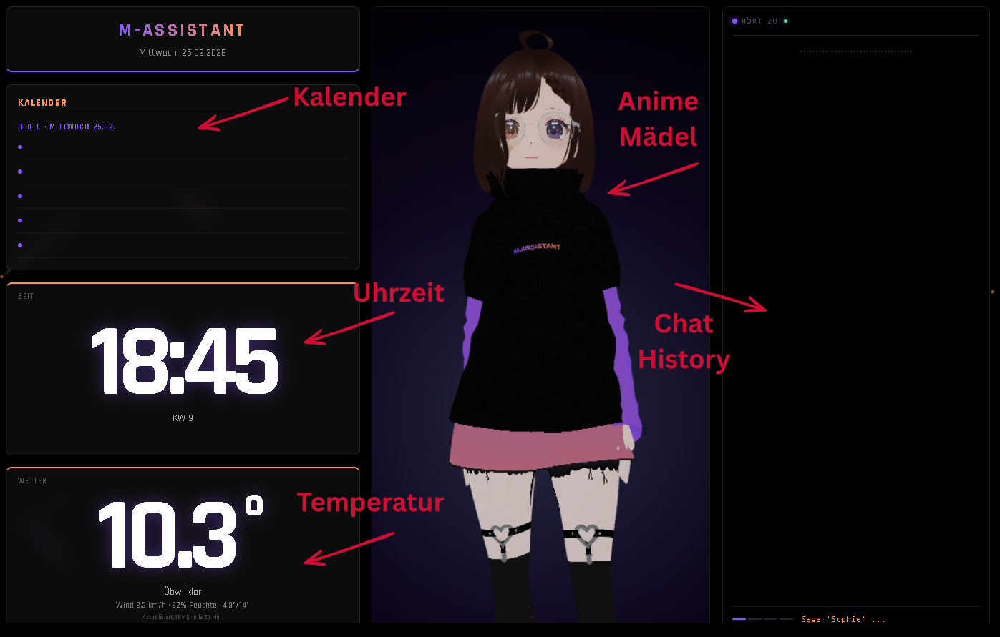

Hier ist die angepasste und sehr ausführliche `README.md` für SOPHIE v3.6.

***

# M-ASSISTANT



**Sophie** ist ein vollständig lokaler, privatsphäre-orientierter Sprachassistent, spezialisiert auf die deutsche Sprache. Sie kombiniert moderne KI-Technologien (Whisper, Sentence-Transformers, LLMs) mit einer Multi-Client-Architektur, um dein Zuhause intelligent zu vernetzen – ohne Cloud-Zwang.

Version 3.6 bringt massive Upgrades im Bereich NLP (Sprachverständnis), persistente Timer und Unterstützung für synchronisierte Gerätegruppen.

## ✨ Hauptfunktionen (v3.6)

*   **OpenWakeWord:** Es wird ein eigens Trainiertes OpenWakeWord model genutzt damit Sophie auf reagiert wenn man sie anspricht.
*   **3-Schicht NLP-Engine:**
    1.  **Regex-Vorfilter:** Mikrosekunden-Reaktion für Standardbefehle (Zeit, Licht).
    2.  **Sentence-Transformer:** (`paraphrase-multilingual-MiniLM-L12-v2`) Versteht Absichten auch bei ungenauen Formulierungen (Semantic Matching).
    3.  **LLM-Fallback:** Leitet komplexe Wissensfragen an eine lokale KI weiter.
*   **Präzise Spracherkennung:** Nutzt OpenAI **Whisper** (Modell: `small` oder `medium`) inkl. Fuzzy-Logik zur Korrektur typischer Hörfehler.
*   **Device Groups (Multi-Room):** Mehrere Clients (z.B. Tablets) können als eine Gruppe agieren.
    *   *Smart Listening:* Nur ein Gerät antwortet.
    *   *Sync-TTS:* Sprachausgabe erfolgt synchron auf allen Geräten der Gruppe.
*   **M-ASSISTANT App Support:** Eigene Android-Client-Schnittstelle.
*   **Organisation:** Lokale JSON-Datenbanken für Kalender, Notizen, To-Dos und Erinnerungen.

---

## 🛠️ Externe Voraussetzungen

Sophie fungiert als "Gehirn" und Orchestrator. Für die KI-Intelligenz und die Stimme werden zwei externe Backend-Services benötigt, die **vor** Sophie gestartet werden müssen. (Wobei KoboldCPP auch optional ist.)

### 1. KI-Backend (LLM)
Für freie Konversationen und Wissensfragen benötigt Sophie eine API-Schnittstelle zu einem LLM.
*   **Empfehlung:** [KoboldCPP](https://github.com/LostRuins/koboldcpp)
*   **Konfiguration:** Der Server muss standardmäßig unter `http://localhost:8002` erreichbar sein.
    *   Falls du eine andere URL/Port nutzt, passe den Wert `api_url` in der `sophie.py` an.

### 2. Sprachausgabe (TTS)
Für eine hochwertige, natürliche deutsche Stimme nutzt Sophie die XTTS-Architektur.
*   **Server:** [xtts-api-server](https://github.com/daswer123/xtts-api-server)
*   **Konfiguration:** Der Server muss unter `http://localhost:8020` erreichbar sein.
*   **Referenzstimme:** Im Ordner `/speakers-for-xtts` dieses Projekts liegt eine Datei (`1.wav`). Diese gibt eine Vorlage für Sophies Stimme.
    *   *Hinweis:* Ohne diesen Server fällt Sophie auf die roboterhafte Systemstimme (`pyttsx3`) zurück.

---

## 📱 Android Client: M-ASSISTANT

Um Tablets oder alte Smartphones als "Echo Show"-Alternative zu nutzen, gibt es den M-ASSISTANT Client.

*   **Funktion:** Verbindet sich via WebSocket mit Sophie, streamt Audio vom Mikrofon zum Server und empfängt Audio/Text-Antworten.
*   **Status:** Es gibt vorgefertigte APKs in dieser Repo, sobald die APP stabil läuft gibt es auch den Source Code dazu hier in der Repo.
    *   ⚠️ *Hinweis: Die App befindet sich noch seeeehr am Anfang der Entwicklung und kann aktuell noch Fehler (Bugs) enthalten.*

---

## 🚀 Installation

### 1. Repository klonen
```bash
git clone https://github.com/Fischherboot/M-ASSISTANT.git
cd M-ASSISTANT
```

### 2. Umgebung einrichten
Es wird empfohlen, eine virtuelle Python-Umgebung zu nutzen.
Dies kann man aber auch ignorieren.

### 3. Setup-Skript ausführen
Das Skript installiert alle Python-Abhängigkeiten (Torch, Whisper, Sentence-Transformers, etc.) und erstellt die nötigen Ordnerstrukturen.
```bash
python install.py
```
*Hinweis: Für NVIDIA-GPU-Unterstützung (empfohlen für Whisper) muss PyTorch ggf. manuell mit CUDA-Support installiert werden.*

---

## ⚙️ Konfiguration (`sophie.py`)

Die zentrale Konfiguration findest du im `CONFIG`-Dictionary am Anfang der Datei `sophie.py`.

### Wichtige Parameter:
*   **`device_groups`**: Definiert, welche IP-Adressen zusammengehören (z.B. für mehrere Clients im Wohnzimmer).
    ```python
    "device_groups": [
        {"name": "Wohnzimmer", "ips": ["192.168.1.50", "192.168.1.51"]},
    ],
    ```
*   **`weather_city` / `weather_lat` / `weather_lon`**: Standort für die Wettervorhersage.

---

## ▶️ Starten & Bedienung

Stelle sicher, dass KoboldCPP (Port 8002) und XTTS (Port 8020) laufen.

Starten des Servers:
```bash
python sophie.py
```

Beim Start listet Sophie alle Audio-Geräte auf. Wähle das gewünschte Ausgabegerät (z.B. Lautsprecher oder VB-Cable für VRM Avatare).

### Web-Interfaces
Sophie stellt mehrere Ports bereit:

1.  **Dashboard (Browser):** `http://localhost:8765`
    *   Zeigt Live-Transkription, erkannten Intent und Status an.
    *   Das Dashboard über den Browser wird ausdrücklich Empfohlen!
2.  **App-Verbindungen:**
    *   Port `8775`: App UI (Text & Status)
    *   Port `8776`: Audio-Input Stream
    *   Port `8777`: Audio-Output Stream

### VRM Avatar (Optional)
Für die visuelle Darstellung (Lippensynchronisation) eines 3D-Avatars;
*   Einfach den Ordner `/vrmbackend` öffnen und:
```bash
python vrm_avatar_server.py
```
Siehe `info vrmavatar.txt` für Details zu Parametern.

---

## 📂 Datenhaltung

Alle persönlichen Daten werden lokal im Ordner `data/` gespeichert:
*   `timers.json`: Speichert aktive Timer mit absoluter Zielzeit (robust gegen Abstürze).
*   `kalender.json`: Termineinträge.
*   `notizen.json` & `todo.json`: Listenverwaltung.
*   `erinnerungen.json`: Geplante Erinnerungen.

---

## 🧠 NLP Architektur Details

Sophie v3.6 nutzt eine fortschrittliche Pipeline, um Befehle zu verstehen:

1.  **ASR-Korrektur:** Whisper macht oft Fehler wie "Füge hinzu" -> "Függer". Eine Fuzzy-Logik (Levenshtein-Distanz) repariert diese Fehler vor der Analyse.
2.  **Intent Matching:**
    *   Der Satz wird in einen Vektor umgewandelt (Embedding).
    *   Er wird mit hunderten Beispielsätzen verglichen.
    *   Liegt die Ähnlichkeit über **0.50**, wird der Befehl ausgeführt.
3.  **LLM Fallback:**
    *   Liegt die Ähnlichkeit unter dem Schwellenwert (z.B. 0.25), wird der Text an KoboldCPP gesendet ("Warum ist der Himmel blau?").

---

## License

<details>
<summary>Click to view MORITZSOFT OPEN LICENSE (MSOL)</summary>

**MORITZSOFT OPEN LICENSE (MSOL)**  
Version 1.0, February 2026

Copyright (c) 2026 Moritzsoft / Moritz Nickel

### TERMS AND CONDITIONS FOR USE, REPRODUCTION, AND DISTRIBUTION

**1. DEFINITIONS**  
"License" shall mean the terms and conditions for use, reproduction, and distribution as defined by Sections 1 through 6 of this document.

"Licensor" shall mean the copyright owner or entity authorized by the copyright owner that is granting the License.

"Software" shall mean the copyrightable work of authorship, including but not limited to source code, object code, documentation, and associated media files, made available under this License.

"Assets" shall mean images, textures, 3D models, audio files, and branding elements contained within the Software.

**2. GRANT OF LICENSE**  
Subject to the terms and conditions of this License, the Licensor hereby grants to You a perpetual, worldwide, non-exclusive, no-charge, royalty-free, irrevocable license to reproduce, prepare derivative works of, publicly display, publicly perform, sublicense, and distribute the Software and its derivative works in Source or Object form.

**3. ATTRIBUTION (ZERO CLAUSE)**  
Unlike standard open source licenses, this License strictly waives any requirement for attribution. You are NOT required to include the original copyright notice, license text, or credit to the Licensor in any derivative works or redistributions of the Software.

**4. USE OF ASSETS AND BRANDING**  
*   **4.1. Inclusion of Assets:** Permission is granted to use, display, and distribute Assets (including logos and branding materials) included within the Software in their original form as part of the Software's operation.
*   **4.2. Replaceability:** The Licensor warrants that the Software is architected to facilitate the modification and replacement of Assets (e.g., via configuration files, stream folders, or asset dictionaries).
*   **4.3. Recommendation:** While the use of default Assets is permitted, the Licensee is encouraged to replace branding Assets to establish independent identity. The Licensor shall not be held liable for conflicts arising from the use of default branding in third-party environments.

**5. NO AFFILIATION / IMPERSONATION**  
Use of the Software and its Assets does not grant You the right to use the Licensor's trade names (specifically "Moritzsoft") to endorse or promote products derived from this Software, nor to claim official affiliation, successor status, or partnership with the Licensor, without specific prior written permission.

**6. DISCLAIMER OF WARRANTY**  
UNLESS REQUIRED BY APPLICABLE LAW OR AGREED TO IN WRITING, LICENSOR PROVIDES THE SOFTWARE ON AN "AS IS" BASIS, WITHOUT WARRANTIES OR CONDITIONS OF ANY KIND, EITHER EXPRESS OR IMPLIED, INCLUDING, WITHOUT LIMITATION, ANY WARRANTIES OR CONDITIONS OF TITLE, NON-INFRINGEMENT, MERCHANTABILITY, OR FITNESS FOR A PARTICULAR PURPOSE. YOU ARE SOLELY RESPONSIBLE FOR DETERMINING THE APPROPRIATENESS OF USING OR REDISTRIBUTING THE SOFTWARE AND ASSUME ANY RISKS ASSOCIATED WITH YOUR EXERCISE OF PERMISSIONS UNDER THIS LICENSE.

_For more information, visit [moritzsoft.de](https://moritzsoft.de)_


</details>
